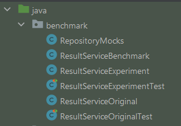

# 3. ISO25010 pijler: performance

> 
>
> __Elron Husky, CEO of *Husky Martian Political Systems*:__
>
> "People are happy with Hupol, not because voting
> is awesome (it is!) but because our software is the fastest.
> Not only does our API respond *blazingly* fast, our algorithms
> are hand-picked (and printed and reviewed on the best paper) 
> to become the best and squeeze every little
> bit of power out of the JVM. 
> Like a rocket going *to the moon* -- I mean ... Mars."

## De opdracht
Performance wordt vaak ondergewaardeerd door software developers.
Het kan het verschil maken in hoe
klanten de software waarderen: 
wie heeft het geduld om te wachten op langzame software?
Bovendien betekent efficiënte code dat kan worden
bespaard op hardware en energiekosten.

De functionaliteit van Hupol lijkt te werken, 
dat blijkt uit de unit en integration tests. 
Maar werkt het nog zo soepel met meer data? 

Evaluaeer en verbeter de prestaties van 
de applicatie. Hier
kunnen we onze kennis inzetten over *algoritmische
complexiteit*, *prestatiemetrieken* en *performance testing*.

### Stap 1. Bestudeer de code en het materiaal
Bekijk de code van de *results component*,
lees de opdracht door en doorgrond het lesmateriaal.

Waar moeten we op letten wanneer het over performance gaat?
Hoe kunnen we performance meten? Waar zitten typische verbeteringen?

### Stap 2. Noteer wat er beter kan

Schrijf in een paar zinnen of punten op wat er volgens jou beter kan
wat betreft de performance van de `results` component.

Dat kan je doen in een nieuw markdown-bestand
(bijvoorbeeld `docs/3-notes.md`).

Sta in het bijzonder stil bij de schaalbaarheid van het algoritme,
in [Big O notation](https://craigndave.org/wp-content/uploads/2020/09/big-o-notation-cheat-sheet.pdf). 
Uitgebreide voorbeelden kan je vinden in [deze blogpost](https://adrianmejia.com/most-popular-algorithms-time-complexity-every-programmer-should-know-free-online-tutorial-course/).
Welke *time complexity* (in Big O) 
heeft deze code, denk je? Waar zit hem dat in?

> ❗ Verander nog *niets* aan de code, dat komt in latere stappen!

Schrijf suggesties om de performance te verbeteren ook (kort) op.
Vaak kunnen we verwerkingssnelheid, geheugengebruik, parallellisering
uitwisselen ter verbetering van de waargenomen prestaties.

Commit en push je werk.
Denk aan een zinvolle, beschrijvende commit message.

### Stap 3. Voer een nulmeting uit

Laten we de results API testen.

#### 3A. Een basale meting met Postman
We hebben wat testdata opgenomen onder `test/resources/fixtures/candidates-01.csv`
en `test/resources/fixtures/votes-01.csv`. 
Deze data wordt gebruikt voor onze integration tests, maar 
dat kunnen we vast ook wel gebruiken om een performance test op te baseren, toch?

Voeg de CSVs toe door via de web APIs van *candidates* en *votes*.

Vraag nu de results op van election `0` via `GET localhost:8080/election/0/results`.
In Postman zie je rechtsboven je response (naast de status code 200) een indicatie
van hoe lang de totale request-response duurde. Voor meer informatie kan je je muis
eroverheen houden. Waarschijnlijk is dit in de milliseconden. 

Voor de zekerheid kan je de request nog een paar keer draaien.
Waarschijnlijk zie je weinig verschil. Dat valt dan toch best mee qua snelheid!?

Maak een screenshot (`WIN + S`) van je Postman response time
en sla deze op onder `docs/perf-postman-1` met file-extensie. Je kan het ook in je `3/notes.md` 
[opnemen](https://www.digitalocean.com/community/tutorials/markdown-markdown-images).

#### 3B. Betrouwbaarder meten met Apache Benchmark
Check in de commandline of je `ab` hebt geinstalleerd: `ab -v`.
Zo niet, [installeer Apache Benchmark](https://www.cedric-dumont.com/2017/02/01/install-apache-benchmarking-tool-ab-on-windows/).
Vergeet niet Apache's `bin` directory toe te voegen aan je `PATH` 
in je [omgevingsvariabelen](https://docs.oracle.com/en/database/oracle/machine-learning/oml4r/1.5.1/oread/creating-and-modifying-environment-variables-on-windows.html) toe te voegen!

Draai Apache Benchmark tegen dezelfde URL.
Hiermee kunnen we een betrouwbare meting doen door bijvoorbeeld 1000 requests
af te vuren (`-n`) en de response time te zien per percentage van de requests.

Zorg wel dat je je authentication key meegeeft als Bearer token in de header (`-H`)
Deze key kan je achterhalen door eerst met Postman in te loggen en
naar de response header te kijken.

```shell
ab -n 1000 -H 'Authorization: Bearer mytoken' localhost:8080/election/0/results
```

> **Leuk om uit te proberen:** 
> 
> Tijdens de test kan je ook naar het resource-gebruik kijken
> van Java. Bijvoorbeeld door de applicatie te starten met de 
> [IntelliJ-profiler](https://lp.jetbrains.com/intellij-idea-profiler/) 
> of gebruik te maken van 
> [VisualVM](https://visualvm.github.io/).

Wijkt deze meting met `ab` veel af van je simpele meting met Postman?

Maak weer een screenshot (`WIN + S`) van deze performance
en sla deze op onder `docs/perf-ab-1` met file-extensie. Je kan het ook in je `3/notes.md`
[opnemen](https://www.digitalocean.com/community/tutorials/markdown-markdown-images).

#### 3C. Realistischere data gebruiken

Het algoritme lijkt in orde met deze hoeveelheid data!
Maar hoe schaalt het algoritme wanneer er meer gegevens in het systeem zitten?
Wat verwacht je?

In de Docker-container van onze database zitten twee CSV-bestanden opgenomen
onder `/var/hupol`. Deze we kunnen importeren in de database. 
De import APIs zijn namelijk ongeschikt voor grote bestanden met duizenden rijen.

> Let op! Het volgende werkt niet wanneer je het datamodel hebt aangepast tijdens het refactoren.
> 
> Probeer te werken op een [nieuwe branch](https://linuxhint.com/create-branch-from-commit-in-git/), 
> getrokken vanaf het startpunt van de repository.

1. Zorg dat je de applicatie al eens hebt gedraaid, 
zodat de juiste tabellen zijn aangemaakt door Spring Boot
2. Duik de container in via: `docker-compose exec db bash`
Dit opent `bash` (een command line shell) in de `db` container
3. Voer de volgende twee commando's uit (dit kan een minuutje duren):
```bash
psql -c "\copy candidate FROM '/var/hupol/candidates.csv' DELIMITER ';' CSV" -U cisq2-hupol;
psql -c "\copy vote FROM '/var/hupol/votes.csv' DELIMITER ';' CSV" -U cisq2-hupol;
```
4. Kijk in je database (met IntelliJ, DataGrip of pgadmin) hoeveel rijen beide tabellen hebben.

Gelukt? Nu zijn we klaar voor het echte werk.

#### 3D. Meten met realistische data

Voer stap 3A uit, maar met de nieuwe data. Wat valt je op?
Maak weer een screenshot en neem deze in je docs op (`docs/perf-postman-2`) met file-extensie.

Voer stap 3B uit, maar met de nieuwe data. Wat valt je op.
Maak weer een screenshot en neem deze in je docs op (`docs/perf-ab-2`) met file-extensie.

### Stap 4. Experimenteer met een Java benchmark
Zou er met Java Streams een 
performance-winst behaald kunnen worden? . 
Misschien kunnen we zelfs de [parallel-methode](https://www.baeldung.com/java-when-to-use-parallel-stream) 
gebruiken...

Tijd voor een experiment! Meten is weten!

Maak een benchmark waarin we de huidige code meten tegenover
een voorgestelde *parallelle* variant.

#### 4A. Voeg Java Microbenchmark Harness (JMH) toe

We gaan onze benchmark draaien met [JMH](https://github.com/openjdk/jmh),
meer info kan je vinden op [Baeldung](https://www.baeldung.com/java-microbenchmark-harness), maar we helpen je op weg.
en [Jenkov](https://jenkov.com/tutorials/java-performance/jmh.html)

Voeg elke `<dependency>` toe onder `<dependencies>` aan de `pom.xml`:
* [jmh-core](https://central.sonatype.com/artifact/org.openjdk.jmh/jmh-core)
* [jmh-generators-annproces](https://central.sonatype.com/artifact/org.openjdk.jmh/jmh-generator-annproces)

Draai Maven, bijvoorbeeld met `mvn dependency:resolve` 
of `mvn compile`.

#### 4B. Experiment-opstelling

Het is een goed idee om onze oude code te behouden
en een experiment toe te voegen,
zodat we onze benchmark tegen de oude en de voorgestelde variant
kunnen draaien.



Daarom hebben onder *test* we een `benchmark` package aangemaakt met
de volgende inhoud:
* `ResultServiceOriginal`: de huidige code base (dit passen we niet meer aan) 
* `ResultServiceExperiment`: nu nog hetzelfde als original, maar hier kunnen we experimenteren
* `ResultServiceOriginalTest`: check of de functionaliteit van original niet verandert
* `ResultServiceExperimentTest`: check of de functionaliteit van experiment niet verandert
* `RepositoryMocks`: handige methodes om mocks voor votes en candidates te hebben
* `ResultServiceBenchmark`: hier nemen we onze benchmark code op

#### 4C. Zet de benchmark op

Voeg aan de ResultServiceBenchmark een `main`-methode toe 
als entrypoint:
```java
public class ResultServiceBenchmark {
    public static void main(String[] args) throws Exception {
        org.openjdk.jmh.Main.main(args);
    }
}
```

We willen natuurlijk niet elke keer opnieuw de service, de mocks en 
de test data aanmaken. Hiervoor kunnen we in JMH gebruik maken van `@State`
om een gedeelde toestand bij te houden. `Scope.Benchmark` houdt in dat we het 
voor de hele benchmark willen bewaren. We moeten wel zorgen dat we de services
de eerste run initialiseren. Hiervoor kunnen we een setup-methode maken met `@Setup`.
`Level.Trial` houdt in dat het één keer wordt gedraaid: bij het opstarten van de gehele benchmark.

Laten we deze informatie gebruiken.
Voeg een [nested class](https://docs.oracle.com/javase/tutorial/java/javaOO/nested.html) toe aan de bovenkant 
binnen *ResultServiceBenchmark* klasse,
waarmee we de context kunnen bijhouden:

```java
public class ResultServiceBenchmark {
    @State(Scope.Benchmark)
    public static class Context {

        public ResultServiceOriginal original;
        public ResultServiceExperiment experiment;

        @Setup(Level.Trial)
        public void setup() {
            this.original = new ResultServiceOriginal(RepositoryMocks.candidates(), RepositoryMocks.votes());
            this.experiment = new ResultServiceExperiment(RepositoryMocks.candidates(), RepositoryMocks.votes());
        }
    }
    
    // ...
}
```

Laten we nu onze benchmark methodes aanmaken. We willen een warm-up draaien
om een realistische test te hebben. De HotSpot VM zorgt immers voor optimalisaties
nadat we een tijdje draaien. Daarom, en omdat je op verschillende eigenschappen
wil meten (average time, sample time, throughput, ...) kan een 
goede benchmark soms uren in beslag nemen. 

Die tijd hebben we niet en schiet het doel van de opdracht voorbij.
Daarom gaan we enkel de [throughput]() meten na 2 warm-up fases.
Dit zou zo'n 10 minuten moeten duren.

Voeg het volgende toe aan je `ResultServiceBenchmark`:

```java
public class ResultServiceBenchmark {
    // ...

    @Benchmark
    @Fork(value = 1, warmups = 2)
    @BenchmarkMode(Mode.Throughput)
    public void original(Context context) {
        // your test here
    }

    @Benchmark
    @Fork(value = 1, warmups = 2)
    @BenchmarkMode(Mode.Throughput)
    public void experiment(Context context) {
        // your test here    
    }
    
    // ...
}
```

Je moet zelf de tests invullen, 
je kan de gewenste services als volgt
gebruiken: `context.original` of `context.experiment`.

Wil je checken of je opzet werkt? 
Dan kan je nu de benchmark draaien.
Als het goed is, moet de uitkomst ongeveer 
hetzelfde zijn. Dit kan wel zo'n tien minuten duren!
Maak weer een screenshot en neem deze in je docs op (`docs/jmh-1`) met file-extensie.

#### 4D. Experimenteer met verbeteringen

Voer de voorgestelde optimalisaties 
door met parallelle streams en verbeterde 
algoritmische complexiteit in `ResultServiceExperiment`.

We mogen het datamodel en de repositories nog niet aanpassen. 
Toch zijn er manieren om het algoritme efficiënter te maken!
Vaak kunnen we verwerkingssnelheid, geheugengebruik, parallellisering
uitwisselen ter verbetering van de waargenomen prestaties.
We willen voorkomen dat we dingen dubbelop doen en
de juiste data types gebruiken om de algoritmische complexiteit
te verbeteren.

Optimaliseer het algoritme. Werk in kleine stapjes en
draai steeds de tests om te zien of het nog werkt!
Misschien kan je zelfs zien dat de tests minder traag worden...

Commit en push je werk.
Denk aan een zinvolle, beschrijvende commit message.
Maak weer een screenshot en neem deze in je docs op (`docs/jmh-2`) met file-extensie.


#### 4E. Draai de benchmark

Draai de benchmark via de main-methode in de ResultServiceBenchmark.
Neem de resultaten op in je notities (`docs/3-notes.md`) in een
code-block of een screenshot.

Probeer in je notities ook de verbeteringen te duiden.
Welke verbeteringen heb je doorgevoerd? Zie je dat terug 
in de resultaten?

Commit en push je werk.
Denk aan een zinvolle, beschrijvende commit message.

### Stap 5. Optimaliseer de echte service

Gebruik de resultaten uit de benchmark om de 
service-implementatie te optimaliseren.
We mogen het datamodel en de repositories nog niet aanpassen
(zie stap 6).

Commit en push je werk.
Denk aan een zinvolle, beschrijvende commit message.

### Stap 6. Optimaliseer de component

We hebben het algoritme verbeterd, maar zijn nog niet helemaal tevreden.
Het probleem zit op een fundamenteler niveau!
Optimaliseer de *results* component en betrek daar ook de database bij.

Je kan bijvoorbeeld een 
nieuwe repository aanmaken of zelfs
werken zonder entities of repository!
Het kan interessant zijn om te kijken naar  
[Spring repository interface](https://www.baeldung.com/spring-data-repositories), 
[native queries](https://thorben-janssen.com/native-queries-with-spring-data-jpa/), 
[entity manager](https://www.bezkoder.com/jpa-entitymanager-spring-boot/), 
[jdbcTemplate](https://mkyong.com/spring-boot/spring-boot-jdbc-examples/) en
[custom repositories](https://stackoverflow.com/questions/55513776/create-spring-repository-without-entity) werken.

> ❗ Vergeet niet om, waar nodig, je tabellen te legen 
>  als je het datamodel aanpast
> (in `cisq2-hupol` en `cisq2-hupol-test`)!
> 
> In de praktijk zou je hier database-migraties voor uitvoeren.
> Lijkt dit je interessant, dan kan je naar kijken naar
> [flyway](https://www.baeldung.com/database-migrations-with-flyway).
> 
> Probeer daarom de candidate en vote tabellen niet te wijzigen,
> anders moet je zelf nieuwe testdata genereren 
> (zie development/fakedatagenerator voor het JavaScript-bestandje).
> 
> Mogelijk moet je ook de `RepositoryMocks` klasse aanpassen.

### Stap 7. Voer een eindmeting uit
Herhaal stap 3D. Maak weer screenshots.
Deze kan je `perf-postman-final` en `perf-ab-final` noemen met file-extensie.

Beschrijf in je `docs/3-notes.md` of je deze uitkomst had verwacht.
Verklaar het resultaat.

### Stap 8. Reflecteer
Wat voor gevolgen zijn er voor maintainability en security wanneer we bovenstaande performance upgrades toepassen? Beschrijf eventuele trade-offs in eigen woorden. Gebruik van generatieve AI is voor dit gedeelte verboden.

### Stap 9. Toekomstige upgrades
Je bent waarschijnlijk nog niet tevreden met het systeem
en de performance ervan. Van welke andere systeemonderdelen 
zou je de performance willen of kunnen verbeteren?

Zou je een prestatiewinst kunnen boeken met een andere structuur?

Beschrijf dit in je `docs/3-notes.md`. Vermeld gebruikte bronnen!

**(Optioneel voor extra punten)**: Probeer de performance verder te verbeteren
door te meten, de resultaten te analyseren, verbeteringen te zoeken
ten slotte deze te implementeren.

Gebruik eventueel zoekmachines voor inspiratie, inzicht en advies.
Blijf wel rekening houden met de andere kwaliteitsaspecten!